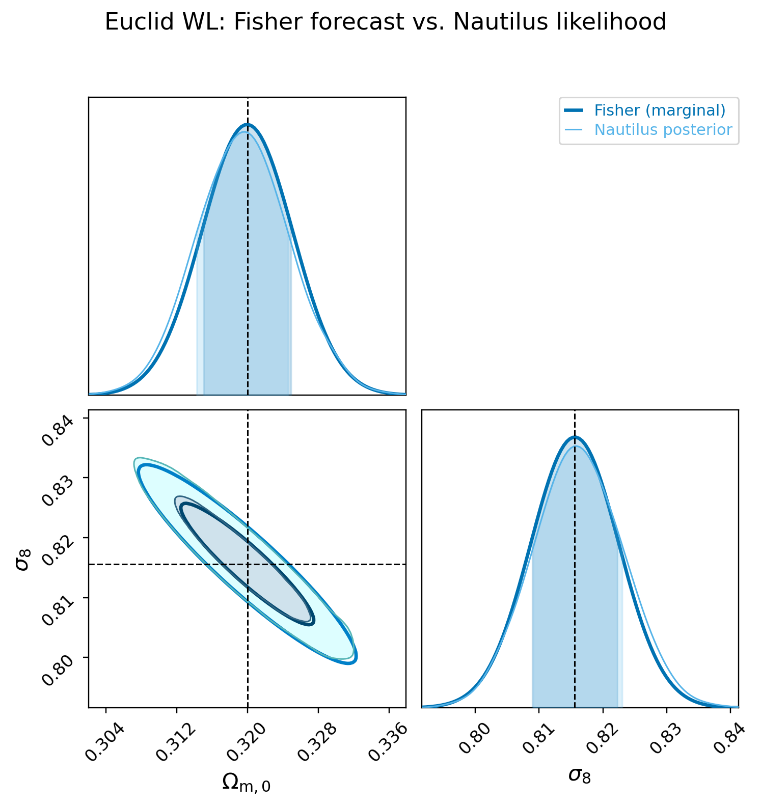
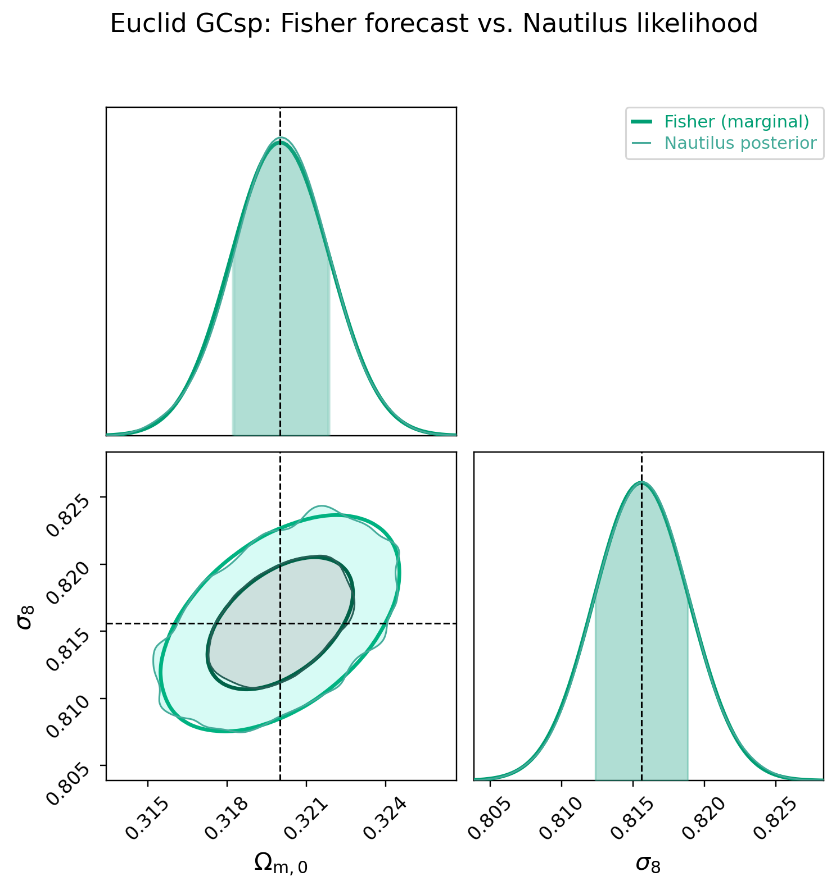
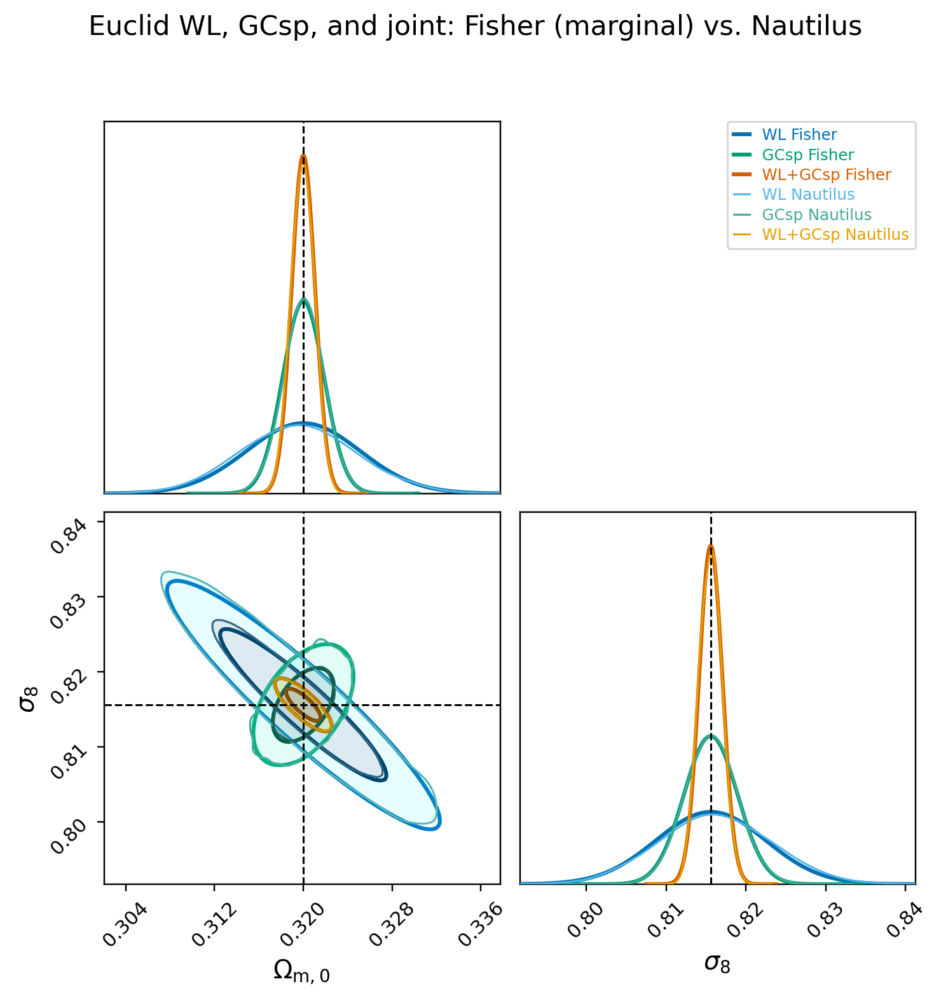

# Likelihood Validation

## Scope

This validation compares the Fisher forecasts produced by CosmicFishPie with
posterior samples from its Nautilus likelihood interface. It is intentionally a
focused integration test rather than a claim that every likelihood,
configuration, or cosmological model has been validated.

The recorded run uses the symbolic backend, flat LCDM, Euclid ISTF pessimistic
photometric and spectroscopic specifications, and the free cosmological
parameters `Omegam` and `sigma8`. All nuisance parameters automatically added
by the corresponding Fisher calculation were sampled: three intrinsic-alignment
parameters for WL and four galaxy-bias plus four shot-noise parameters for
GCsp. Thus the Nautilus posteriors and Fisher contours are both marginalised
over the same nuisance parameter sets.

The run used 64 Nautilus workers, `n_live=500`, and `n_eff=2000`. The tracked
summary statistics live in
`scripts/likelihood_validation_results/wl_gcsp_symbolic_euclid_64cpu_statistics.json`.
The raw chains and checkpoints are intentionally excluded from the repository.

## Results

The figures were generated with CosmicFishPie's ChainConsumer integration from
the weighted Nautilus chains. Each probe has a stable color pair: dark contours
are marginal Fisher forecasts and lighter contours are Nautilus posterior
samples. WL is blue, GCsp is green, and the joint result is orange. Dashed
lines mark the fiducial cosmology.

### Weak Lensing



### Spectroscopic Galaxy Clustering



### Joint WL + GCsp

This overview shows all six contours: the WL, GCsp, and joint Fisher-Nautilus
pairs.



| Probe | Nautilus / Fisher: `sigma(Omegam)` | Nautilus / Fisher: `sigma(sigma8)` | Correlation: Nautilus / Fisher |
| --- | ---: | ---: | ---: |
| WL | 1.044 | 1.048 | -0.9930 / -0.9932 |
| GCsp | 1.004 | 1.003 | +0.4961 / +0.5083 |
| WL + GCsp | 1.013 | 1.005 | -0.8546 / -0.8501 |

The posterior means are within 0.09 standard deviations of the fiducial for
WL, 0.02 for GCsp, and 0.06 for the joint case. Within the sampling precision
of the retained chains, this validates the tested WL, GCsp, and joint wedge
likelihood implementations against their corresponding marginal Fisher
forecasts.

## Computational Resources

Each probe was submitted as an independent Slurm job with `CPUS_PER_TASK=64`.
The case runner passed all 64 allocated CPUs to Nautilus as multiprocessing
workers and pinned OpenMP, BLAS, and NumExpr thread counts to one, avoiding
oversubscription inside each worker.

| Case | Sampled dimensions | Nautilus workers | `n_live` | Target `n_eff` | Recorded elapsed time | Chain ESS |
| --- | ---: | ---: | ---: | ---: | ---: | ---: |
| WL | 5 | 64 | 500 | 2000 | 17 min 03 s | 2101 |
| GCsp | 10 | 64 | 500 | 2000 | 22 min 29 s | 2764 |
| WL + GCsp | 13 | 64 | 500 | 2000 | 1 h 45 min 05 s | 2057 |

Elapsed times include Fisher setup and Nautilus sampling; the latter dominates
each case. The three jobs ran concurrently, so their times must not be summed
as sequential wall time. The joint case sets the approximately 1 h 45 min
validation makespan.

The metadata does not identify the exact JURECA node class. Consult the
[JURECA DC hardware configuration](https://apps.fz-juelich.de/jsc/hps/jureca/configuration.html#hardware-configuration-of-the-system-name-dc-module-phase-2-as-of-may-2021)
and Slurm accounting records for node-specific hardware details.

## Reproduction

Run the three independent Slurm cases and their dependent post-processing job:

```bash
RUN_DIR=/scratch/$USER/cfp/wl-gcsp-64cpu \
N_LIVE=500 N_EFF=2000 CPUS_PER_TASK=64 \
scripts/slurm/submit_wl_gcsp_nautilus.sh
```

After copying a completed run locally, regenerate the tracked evidence without
copying chains into the repository:

```bash
uv run python scripts/render_likelihood_validation.py \
  --run-dir hpc-results/wl-gcsp-64cpu
```
