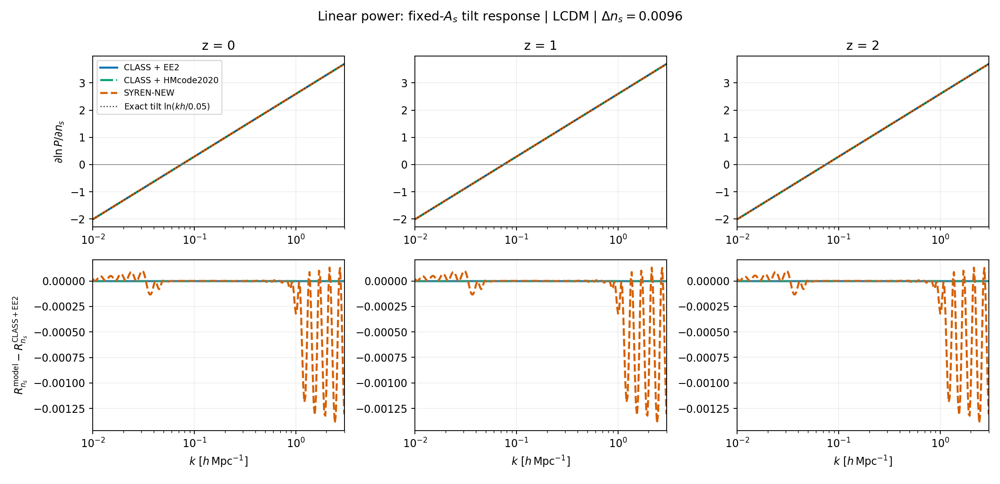
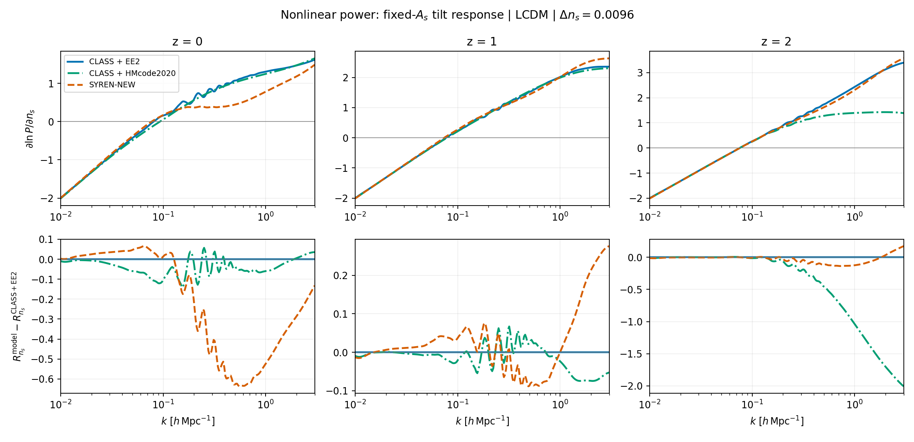
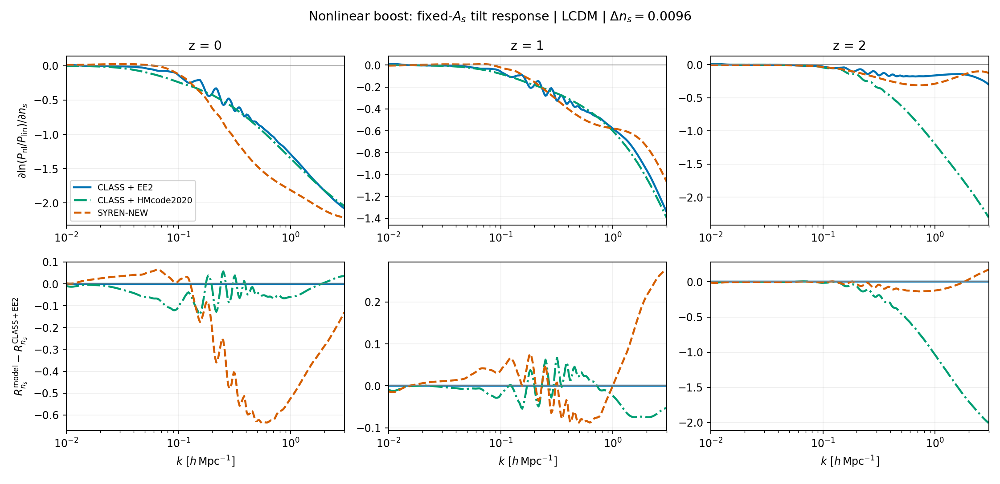
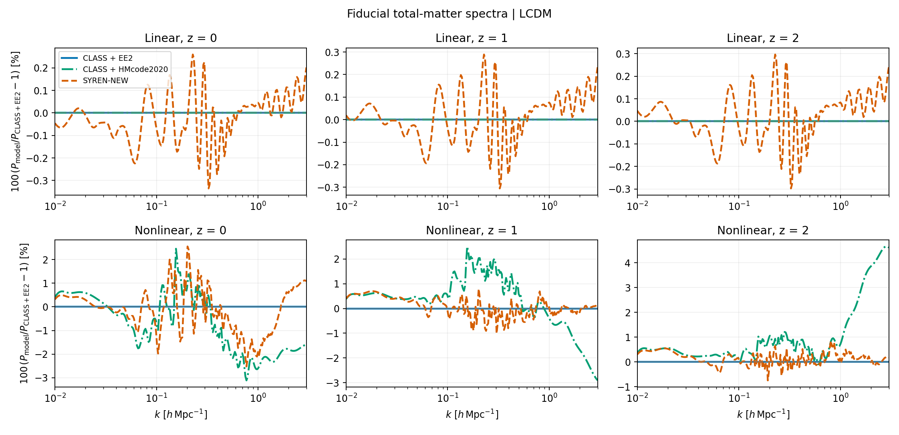

# SYREN-NEW spectral-tilt response and photometric Fisher discrepancies

## Main finding

The photometric comparison identifies **the nonlinear response to the primordial
spectral index `ns` as an important source of SYREN-NEW versus EE2 disagreement**.
The symbolic formula contains explicit `ns` dependence that strongly cancels the
linear tilt response at some low-redshift nonlinear scales. Fixing `ns` in the
saved LCDM Fisher matrices greatly reduces several marginalized-error differences.

This is evidence of a **response mismatch and altered degeneracies**, not proof
of a transcription error in SYREN-NEW or proof that this derivative is the only
source of the Fisher differences. EE2 is the comparison reference, not an assumed
exact solution. A controlled derivative-swap experiment remains the cleanest way
to isolate causality.

Analysis date: 2026-09-29. The user confirmed that the full photometric notebook
ran successfully after the earlier HMcode non-finite-grid handling fix. That
operational issue is separate from the finite response discrepancy studied here.

## Inputs and numerical definitions

The originating notebook is
[`SYREN-investigation_Photo-EE2-vs-matched.ipynb`](../../notebooks/SYREN-investigation_Photo-EE2-vs-matched.ipynb).
Despite its historical filename, the inspected run uses the following **photo** profiles:

| Case | Packaged profile |
|---|---|
| CLASS + EE2 | `class/ee2_boost_photo.yaml` |
| CLASS + HMcode2020 | `class/hmcode2020_photo.yaml` |
| SYREN-NEW | `symbolic/syren_new_photo.yaml` |

They reside in `cosmicfishpie/configs/default_boltzmann_yaml_files/`. The comparison
is for **total-matter** power, not a separate cold+baryon prediction.

| Parameter | Fiducial |
|---|---:|
| `10^9As` | 2.1 |
| `Omegam` | 0.32 |
| `Omegab` | 0.05 |
| `h` | 0.67 |
| `ns` | 0.96 |
| `mnu` | 0.06 eV |
| `w0`, `wa` | −1, 0 |

All other parameters, including primordial amplitude **As**, are fixed during
the `ns` variation. The CLASS profiles use the matched three-degenerate-neutrino
translation (`N_ur=0.00641`, mass-density factor 93.14). The wrapper passes `ns`
correctly, and its sigma8-to-As conversion is not invoked when `10^9As` is supplied.

The response plotted below is a central difference of **logarithmic power**:

```{math}
R_{n_s}(k,z) = \frac{\partial\ln P(k,z)}{\partial n_s}
\simeq \frac{\ln P(k,z;n_s+\Delta n_s)-\ln P(k,z;n_s-\Delta n_s)}{2\Delta n_s}.
```

The default half-step is **0.0096**, the notebook's 1% relative `ns` step. This is
not differentiation with respect to log ns. The script also saves the central
difference of power itself, `dP_dns`, which is distinct at finite step from
`P_fiducial * response`.

The plotted grid is `k=0.01–3 h/Mpc`, at `z=0,1,2`. The public `Pmm` API receives
`k*h` in 1/Mpc; returned Mpc³ values are multiplied by `h³`. Both source spline
support and positive, finite output are checked. No extrapolated points are used.

## Reproduce the figures

The maintained script is
[`scripts/validation/plot_ns_power_response.py`](../../scripts/validation/plot_ns_power_response.py).
An executable companion with explanations, displayed figures and response tables is
[`SYREN-investigation_ns-response.ipynb`](../../notebooks/SYREN-investigation_ns-response.ipynb).
Its default path reads the saved artifacts; the optional recomputation cell invokes
the same script rather than reimplementing the backends.
It uses `build_analysis_context` and `cosmo_functions.Pmm` for **all three cases**,
including native CLASS HMcode and CLASS linear power multiplied by EE2's boost.
It reuses the context's fiducial cosmology and computes only the two shifted
cosmologies per backend: nine total evaluations, without Fisher or angular-spectrum
calculations.

From the repository root, with CLASS, EuclidEmulator2 and symbolic_pofk installed:

```bash
OMP_NUM_THREADS=1 uv run python scripts/validation/plot_ns_power_response.py
```

To redraw the saved arrays without running a cosmology backend:

```bash
uv run python scripts/validation/plot_ns_power_response.py --plot-only
```

To investigate a smaller step while preserving this reference figure set:

```bash
OMP_NUM_THREADS=1 uv run python scripts/validation/plot_ns_power_response.py \
  --ns-step 0.0001 --output-dir results/ns_response_small_step
```

`--cosmo-model w0waCDM` selects that configuration with fixed fiducial `w0=-1, wa=0`;
it does not marginalize any parameters. Use a separate output directory for variants.
Run `--help` for the redshift and k-grid options.

Artifacts: [numerical arrays](_static/ns_response/ns_response.npz) and
[run metadata](_static/ns_response/ns_response_metadata.json). Metadata records
profile contents/hashes, source hashes, dependency versions, resolved fiducial
backend parameters, units, grid and step. Array `power` has axes
`[backend, minus/fiducial/plus, linear/nonlinear, redshift, k]`; `response` and
`dP_dns` omit the variation axis, and `boost_response` also omits the spectrum axis.
Backend order is recorded in `labels`.

### Linear response



The fixed-As primordial tilt predicts `R_ns = ln(k*h/0.05)` for physical pivot
`0.05/Mpc`. The symbolic linear expression has this dependence exactly; its
remaining correction factors are independent of `ns` for this evaluation path.
The public interfaces interpolate power on finite grids, so their derivatives
need not agree with the analytic curve to machine precision. Both CLASS cases
share the same linear physics.

### Nonlinear response



The lower panels show **additive response differences** from CLASS+EE2, not
percent differences. Dividing by a reference derivative near its zero crossing
would create misleading spikes. The broad low-redshift discrepancy away from
zero crossings is the scientifically relevant feature.

The generated public-interface run gives the following nonlinear responses at
`Delta ns=0.0096`:

| z | k [h/Mpc] | CLASS + EE2 | CLASS + HMcode2020 | SYREN-NEW |
|---:|---:|---:|---:|---:|
| 0 | 0.2 | 0.584306 | 0.560257 | 0.367360 |
| 0 | 0.5 | 1.070631 | 1.022561 | 0.442848 |
| 0 | 1.0 | 1.304604 | 1.245154 | 0.781266 |
| 1 | 0.5 | 1.518832 | 1.541994 | 1.431714 |
| 1 | 1.0 | 2.016386 | 1.992768 | 2.017233 |
| 2 | 0.5 | 1.733373 | 1.278536 | 1.616727 |
| 2 | 1.0 | 2.432370 | 1.393950 | 2.307892 |

**Additional observation, not yet diagnosed:** this run also shows a substantial
HMcode high-k response departure at `z=2`, despite much closer fiducial spectra.
This should be checked with step-size and direct CLASS-accessor comparisons before
attributing it to HMcode physics or interpolation. It is not explained by the
SYREN-specific cancellation below. The plotted results are a single-run diagnostic,
not a numerical-convergence certification of any backend.

### Nonlinear-boost response



The boost response is `R_ns(Pnl) - R_ns(Plin)`. Removing the common primordial
tilt makes differences in the nonlinear corrections easier to identify.

### Fiducial spectrum agreement



These spectra use the same fiducial and interpolation pipeline as the response
figures. Good agreement in power values does not guarantee equally accurate
parameter responses.

## The sensitive terms in the symbolic formula

In upstream `symbolic_pofk/syren_new.py`, `pnl_new_emulated` constructs
`L = log10(Plin)` and then `log10(Pnl) = L + term2 + term3 - term4 - term5 - bias(k)`.
Besides dependence through `L`, it has explicit `ns` dependence in the nonlinear
corrections. The particularly sensitive `term3` is

```{math}
T_3 = \frac{(0.6264a-0.3035L+0.6069)\,k}
{0.7882\Omega_m+0.4811k+1.4326n_s-1.8971+
(0.0271L+0.9635k^{0.0264})^{22.9213a-71.1658n_s}}.
```

At `a=1, ns=0.96`, its exponent is **−45.397868**. The `term2` denominator also
contains a power with exponent `27.6818*a - 24.8736*ns` (3.803144 at this point).
Large fitted coefficients alone are not evidence of a bug, but the differentiated
terms exhibit a strong cancellation.

The direct-formula chain-rule decomposition at **z=0, k=0.5 h/Mpc** is:

| Contribution to d ln Pnl / d ns | Value |
|---|---:|
| Linear primordial tilt | +1.90210753 |
| term2 via linear power L | −0.13125580 |
| term2 explicit ns dependence | +0.01353874 |
| term3 via linear power L | +0.57108368 |
| term3 explicit ns dependence | **−1.91242415** |
| **Total** | **+0.44304999** |

The explicit term3 response almost cancels the linear contribution. The final
`pnl_bias(k)` correction is independent of `ns` at fixed h, so it cannot repair
the logarithmic tilt response (although it rescales the absolute derivative).

For source provenance, consult the run metadata's `symbolic_pofk.syren_new` entry.
The integration layer is
[`cosmicfishpie/cosmology/symbolic_new.py`](../../cosmicfishpie/cosmology/symbolic_new.py).
The maintained plotting script calls that implementation; it does not duplicate
or modify the symbolic fit.

## Direct-formula response and step-size check

The initial diagnosis evaluated the symbolic formula directly and compared it
with **exact linear tilt plus the EE2 boost response**, before running the
three-backend public-interface plotting script. At `Delta ns=0.0001, z=0`:

| k [h/Mpc] | SYREN-NEW response | EE2 boost + exact linear response | SYREN / reference − 1 |
|---:|---:|---:|---:|
| 0.2 | 0.367503 | 0.584554 | −37.1% |
| 0.5 | 0.443050 | 1.074483 | **−58.8%** |
| 1.0 | 0.781669 | 1.302355 | −40.0% |

These numbers are not a fresh CLASS calculation and need not exactly match the
public-interface figures, which use power interpolation and the notebook's
larger step. The discrepancy varies with redshift: at `z=1, k=0.5`, the direct
response difference is approximately −6.1%; at `z=1, k=1`, approximately −0.6%.

Over `k=[0.03,0.05,0.1,0.2,0.5,1,3] h/Mpc` and `z=[0,1,2]`, decreasing the
direct SYREN half-step from `0.0096` to `0.0001` changed the log response by at
most **0.00078737**. Decreasing `0.001` to `0.0001` changed it by at most
`8.459e-6`. This is far smaller than the low-z response mismatch. It is a scoped
step-size check of SYREN's direct expression, not a convergence claim for every
backend or the full projected forecast.

The general distinction is straightforward: if `P_syren = P_ref * exp(epsilon)`,
then `R_syren - R_ref = d epsilon / d ns`. A small value error at the fiducial
can coexist with a substantial slope error.

## Evidence from the saved photometric Fisher matrices

The existing artifacts under
`results/photo_class_ee2_vs_syren_new_minimal_matched/` were inspected, not recomputed.
Their names follow
`CosmicFish_v1.3.1_{LCDM|w0waCDM}_photo_{class_ee2|class_hmcode2020|symbolic_syren_new}_GCphWL_FM.txt`.
Parameter ordering was read from each accompanying `.paramnames` file.

Fixing `ns` means deleting its row and column from the **full Fisher matrix**, then
inverting the retained block and marginalizing all other retained parameters,
including survey nuisances. It does not mean deleting a covariance row/column.

| LCDM parameter | SYREN vs EE2 marginalized-error difference, ns free | With ns fixed |
|---|---:|---:|
| As | −34.73% | **−4.84%** |
| Omegam | −3.82% | −1.52% |
| Omegab | −21.97% | −8.22% |
| h | −33.76% | **−7.37%** |

This supports an important role for `ns` degeneracies, without establishing sole
causality. A weaker individual response can yield tighter marginalized constraints
if its shape changes parameter correlations. For example, SYREN's fully conditional
LCDM `ns` error (`1/sqrt(F_ns,ns)`) is **8.53% larger** than EE2's, while its
marginalized `ns` error is **33.78% smaller**.

### Why w0waCDM can show closer relative agreement

Adding dark-energy parameters changes the degeneracy structure. Absolute
constraints weaken, while the relative discrepancy between backends can shrink:

| Marginalized sigma(ns) | CLASS + EE2 | CLASS + HMcode2020 | SYREN-NEW |
|---|---:|---:|---:|
| LCDM | 0.015057 | 0.015340 | 0.009971 |
| w0waCDM | 0.015418 | 0.019250 | 0.013607 |

The fully conditional errors of the five shared cosmological parameters are
unchanged between these two saved model cases for each backend. Closer w0wa
percentage agreement is therefore not evidence that the underlying SYREN
derivative became more accurate.

## Notebook plotting interpretation

Two details in the inspected notebook matter when reading its saved plots:

1. `compare_constraints` uses `compare_to_index=1`, selecting **HMcode2020**,
   although the axis label says EE2. `0` would select EE2. Its printed numerical
   dictionary does compare with EE2. The spectrum helper also selects HMcode
   despite introductory prose describing EE2 residuals. All figures on this page
   explicitly use **CLASS + EE2** as the reference.
2. The darker “unmarginalized” error shading is computed **after omitted nuisance
   parameters have been marginalized** by the plotting helper. It holds the other
   displayed cosmological parameters fixed; it is not the original full-matrix
   conditional error. The LCDM SYREN–EE2 ns difference is approximately 10.27% by
   this plotted definition, versus 8.53% for the full conditional error.

These are observations about the saved notebook version, not changes made to it.

## Interpretation and next discriminating check

The combined evidence supports a nonlinear tilt-response mismatch in the symbolic
fit and an associated change in Fisher degeneracies. Neither decreasing the
finite-difference step nor adjusting an ns-independent multiplicative bias is
expected to remove the measured direct-formula mismatch.

The next controlled experiment should replace **only the ns angular-spectrum
derivative**, keeping the covariance, remaining derivatives, parameter ordering,
nuisance treatment and priors common. Comparing the resulting marginalized errors
would quantify the causal contribution of that one derivative. This experiment
has not been performed here. Removing or retuning the symbolic term ad hoc would
change the calibrated model and is not justified by this diagnostic alone.
